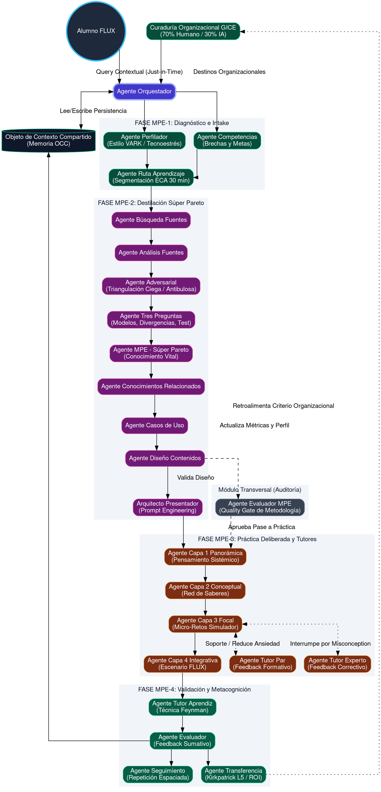

# Arquitectura en Formato DOT y Catálogo Descriptivo de los 24 Agentes MPE

Este documento contiene el flujo arquitectónico renderizado en código `.dot` (Graphviz) conservando el mismo estilo visual (agrupaciones y colores lógicos), y añade un catálogo profundo con la descripción exacta, función y relación de cada uno de los 24 agentes del ecosistema.

## 1. Diagrama de Flujo (Código .dot Graphviz)

---

## 2. Catálogo Descriptivo de los 24 Agentes MPE

El ecosistema se articula mediante el trabajo especializado de 24 agentes (nodos de procesamiento). A continuación, se detalla la función intrínseca y las relaciones de entrada/salida de cada uno.

### Dimensión 0: Orquestación Central
1. **Agente Orquestador (`agente_orquestador`)**
   * **Función:** Es el director de la sinfonía. Su objetivo es asegurar la "fricción cero". Mantiene la máquina de estados, lee y escribe en el OCC, e invoca a los demás agentes según las reglas metodológicas.
   * **Relación:** Recibe el *Query* del usuario, lee GICE, y dispara la Fase 1 delegando al Perfilador y al Agente de Competencias.

### Dimensión 1: FASE MPE-1 (Intake y Diagnóstico)
2. **Agente Perfilador (`agente_perfilador`)**
   * **Función:** Analiza el estado cognitivo y emocional del alumno. Identifica su estilo VARK (Visual, Auditivo, Lector, Kinestésico) y diagnostica niveles de **Tecnoestrés**.
   * **Relación:** Inyecta en el OCC los parámetros para adaptar la granularidad (ej. micro-cápsulas si hay alto estrés).

3. **Agente Competencias y Habilidades (`agente_competencias_habilidades`)**
   * **Función:** Cruza el objetivo del alumno con la matriz de competencias de la organización. Calcula la brecha exacta entre el estado actual y el objetivo.
   * **Relación:** Envía la "brecha neta a cubrir" al Agente de Ruta de Aprendizaje.

4. **Agente Ruta de Aprendizaje (`agente_ruta_aprendizaje`)**
   * **Función:** Opera el fraccionamiento táctico. Toma la meta y la divide en un **ECA (Entorno Controlado de Aprendizaje) estricto de 30 minutos** para evitar el "atracón cognitivo".
   * **Relación:** Recibe datos de Perfilador y Competencias; envía el encargo del bloque de 30 min a la Fase de Investigación.

### Dimensión 2: FASE MPE-2 (Destilación y Curación Súper Pareto)
5. **Agente Búsqueda de Fuentes (`agente_busqueda_fuentes`)**
   * **Función:** Ejecuta el rastreo profundo sobre la curaduría GICE y bases externas (intranet corporativa o *journals*), recuperando la materia prima.
   * **Relación:** Pasa la *data* cruda al Agente de Análisis.

6. **Agente Análisis de Fuentes (`agente_analisis_fuentes`)**
   * **Función:** Realiza la lectura sintética, extrayendo afirmaciones clave, descartando ruido de formato y homogeneizando el texto.

7. **Agente Adversarial de Investigación (`agente_adversarial_investigacion`)**
   * **Función:** Es el "Guardián de la Verdad" (*Red Teamer*). Aplica triangulación ciega contra la fuente de verdad corporativa para destruir datos obsoletos, sesgados o alucinaciones de IA.
   * **Dinámica (El Purgatorio):** Si la premisa sobrevive, se valida. Si es destruida, se empaqueta como "Mito" y se envía directamente al Simulador (Capa 3) para ser usada como "distractor/trampa".
   * **Relación:** Envía la "Verdad Validada" al Agente Tres Preguntas, y envía los "Mitos" a la Capa Focal.

8. **Agente Dominio de las Tres Preguntas (`agente_dominio_tres_preguntas`)**
   * **Función:** Extrae la esencia conceptual (Regla MIT). Identifica: 1) Los Modelos Mentales profundos, 2) Las Discrepancias entre expertos y 3) La Puesta a Prueba (Comprensión vs Memoria).

9. **Agente MPE / Súper Pareto (`agente_mpe`)**
   * **Función:** Es el filtro más estricto. Destila el texto eliminando el 80 o 90% de información técnica secundaria, aislando el **Conocimiento Vital** (el 10 o 20% que produce el 80 o 90% del impacto en el trabajo).

10. **Agente Conocimientos Relacionados (`agente_conocimientos_relacionados`)**
    * **Función:** Construye "puentes interdisciplinares" (basado en Teoría de Flexibilidad Cognitiva). Conecta el conocimiento nuevo con otras disciplinas ajenas al alumno para evitar "silos cognitivos".

11. **Agente Casos de Uso (`agente_casos_uso`)**
    * **Función:** Traslada la teoría abstracta al terreno laboral. Construye escenarios aplicados hiper-relevantes basados en el rol del usuario documentado en el OCC.

12. **Agente Diseño de Contenidos (`agente_diseno_contenidos`)**
    * **Función:** Compila los resultados de todos los agentes anteriores y diseña el esquema lógico del ECA, ordenando la progresión de la enseñanza.

13. **Arquitecto Presentador (`arquitecto_presentador`)**
    * **Función:** Especialista en *Prompt Engineering*. Transmuta el diseño en un guion pedagógico en primera persona, adaptado al tono, la empatía y la narrativa que necesita el alumno según su nivel de tecnoestrés.

### Dimensión 3: FASE MPE-3 (Ejecución Pedagógica - El Simulador)
14. **Agente Capa 1 Panorámica (`agente_capa1_panoramica`)**
    * **Función:** Enseña el "Pensamiento Sistémico" del tema. Ubica el problema en sus 4 dimensiones (organizacional, tecnológica, mercado, humana).

15. **Agente Capa 2 Conceptual (`agente_capa2_conceptual`)**
    * **Función:** Construye la "Red de Saberes". Enseña los fundamentos y definiciones centrales a través de analogías vinculadas a la experiencia previa del alumno.

16. **Agente Capa 3 Focal (`agente_capa3_focal`)**
    * **Función:** Director del **Simulador**. Implementa la Práctica Deliberada mediante micro-retos. Utiliza las discrepancias (Pregunta MIT 2) para forzar decisiones y usa los "Mitos Reciclados" del Agente Adversarial como trampas para evaluar el criterio del alumno.
    * **Relación:** Llama en tiempo real a los Tutores Par y Experto si el alumno titubea o cae en las trampas (mitos).

17. **Agente Capa 4 Integrativa (`agente_capa4_integrativa`)**
    * **Función:** Lleva la simulación a un entorno FLUX. Modifica súbitamente las variables del simulador para obligar al alumno a adaptar lo que acaba de aprender ante la incertidumbre.

**Los 3 Tutores (Intervención Asincrónica en Capa 3 y 4):**
18. **Agente Tutor Par (`agente_tutor_par`)**
    * **Función:** Ofrece **Feedback Formativo**. Piensa en voz alta, reduce la ansiedad, da pistas sin revelar la respuesta y cocrea con el alumno. Se activa si hay inactividad o leve confusión.

19. **Agente Tutor Experto (`agente_tutor_experto`)**
    * **Función:** Ofrece **Feedback Correctivo**. Si el alumno comete un error estructural severo (*misconception* grave), este tutor interrumpe el flujo bruscamente para reconstruir la base teórica y evitar la consolidación de errores.

20. **Agente Tutor Aprendiz (`agente_tutor_aprendiz`)**
    * **Función:** Se activa al final de la Capa 4. Finge incomprensión y obliga al alumno a "enseñarle" lo aprendido (Técnica Feynman). Si el alumno lo explica bien, significa que hay dominio real.

### Dimensión 4: FASE MPE-4 (Auditoría, Transferencia y Memoria)
21. **Agente Evaluador MPE (`agente_evaluador_mpe`)**
    * **Función:** Auditor Transversal (Quality Gate). Opera antes de iniciar la Capa 1 para garantizar que el diseño instruccional no rompa ninguna regla de los Pilares MPE.

22. **Agente Evaluador (`agente_evaluador`)**
    * **Función:** Al final de la sesión, emite el **Feedback Sumativo**. Lee la interacción del simulador, evalúa el cierre con el Tutor Aprendiz y certifica el porcentaje de dominio adquirido en el OCC.

23. **Agente Seguimiento (`agente_seguimiento`)**
    * **Función:** Arquitecto de la infraestructura del "No-olvido". Combate a Ebbinghaus programando micro-ping de Recuperación Activa espaciados en 24h, 72h y 7 días.

24. **Agente Transferencia (`agente_transferencia`)**
    * **Función:** Auditor del **Nivel 5 de Kirkpatrick (ROI)**. Semanas después de la sesión, no evalúa memoria, sino evidencias en el puesto de trabajo. Compara métricas de desempeño para validar si el ECA tuvo impacto real, cerrando el ciclo hacia la organización.
