# Vistas Arquitectónicas del Cerebro MPE (Formato DOT para Desarrollo)

Para que el equipo de ingeniería pueda integrar la arquitectura de 24 agentes en su stack técnico, se han traducido los 4 diagramas visuales al formato estandarizado `.dot` (Graphviz). Esto permite su renderizado y manipulación como código en cualquier ecosistema de desarrollo (integración con repositorios o visores de arquitectura).

---

## 1. Vista de Máquina de Estados (State Machine View)
**Propósito:** Visualizar los bucles de transición de estado, limitadores de iteraciones y transiciones de fase.

```dot
digraph StateMachine {
    fontname="Helvetica,Arial,sans-serif";
    node [fontname="Helvetica,Arial,sans-serif", shape=box, style="rounded,filled", fillcolor="#F8FAFC", color="#94A3B8"];
    edge [fontname="Helvetica,Arial,sans-serif", color="#475569"];
    rankdir=TD;
    compound=true;

    Start [shape=point, width=0.2];
    End [label="Fin Sesión ECA (30 min)", shape=ellipse, style="filled", fillcolor="#E2E8F0"];
    
    Start -> Cargar_OCC [label="Query Usuario"];

    subgraph cluster_Init {
        label = "Init_Session";
        style=filled; color="#E2E8F0"; fontcolor="#0F172A";
        Cargar_OCC [label="Cargar_OCC"];
        Validar_Contexto [label="Validar_Contexto"];
        Cargar_OCC -> Validar_Contexto;
    }

    subgraph cluster_Fase1 {
        label = "Fase_1_Intake";
        style=filled; color="#D1FAE5"; fontcolor="#064E3B";
        node [fillcolor="#059669", color="#047857", fontcolor="white"];
        Perfilar_VARK [label="Perfilar_VARK"];
        Calcular_Brecha [label="Calcular_Brecha"];
        Segmentar_Ruta [label="Segmentar_Ruta"];
        Validacion_Interna [label="Validacion_Interna"];

        Perfilar_VARK -> Calcular_Brecha -> Segmentar_Ruta -> Validacion_Interna;
        Validacion_Interna -> Segmentar_Ruta [label="Ajuste (Max 3 iteraciones)"];
    }

    subgraph cluster_Fase2 {
        label = "Fase_2_Curacion";
        style=filled; color="#FCE7F3"; fontcolor="#831843";
        node [fillcolor="#DB2777", color="#BE185D", fontcolor="white"];
        Ingesta_Fuentes [label="Ingesta_Fuentes"];
        Filtro_Adversarial [label="Filtro_Adversarial"];
        Destilacion_Pareto [label="Destilacion_Pareto"];
        Arquitectura_Prompt [label="Arquitectura_Prompt"];
        
        Ingesta_Fuentes -> Filtro_Adversarial -> Destilacion_Pareto -> Arquitectura_Prompt;
    }

    Quality_Gate_MPE [label="Quality_Gate_MPE", fillcolor="#475569", fontcolor="white"];

    subgraph cluster_Fase3 {
        label = "Fase_3_Ejecucion";
        style=filled; color="#FFEDD5"; fontcolor="#7C2D12";
        node [fillcolor="#EA580C", color="#C2410C", fontcolor="white"];
        Capa_Panoramica [label="Capa_Panoramica"];
        Capa_Conceptual [label="Capa_Conceptual"];
        Simulador_Focal [label="Simulador_Focal"];
        Escenario_Flux [label="Escenario_Flux"];
        
        Capa_Panoramica -> Capa_Conceptual -> Simulador_Focal -> Escenario_Flux;
        Escenario_Flux -> Simulador_Focal [label="Fallo en Aplicación"];
    }

    subgraph cluster_Fase4 {
        label = "Fase_4_Cierre";
        style=filled; color="#D1FAE5"; fontcolor="#064E3B";
        node [fillcolor="#059669", color="#047857", fontcolor="white"];
        Evaluar_Dominio [label="Evaluar_Dominio"];
        Agendar_Repeticion [label="Agendar_Repeticion"];
        Actualizar_OCC [label="Actualizar_OCC"];
        
        Evaluar_Dominio -> Agendar_Repeticion -> Actualizar_OCC;
    }

    Validar_Contexto -> Perfilar_VARK [ltail=cluster_Init, lhead=cluster_Fase1];
    Validacion_Interna -> Ingesta_Fuentes [label="Ruta Óptima", ltail=cluster_Fase1, lhead=cluster_Fase2];
    Arquitectura_Prompt -> Quality_Gate_MPE [ltail=cluster_Fase2];
    Quality_Gate_MPE -> Ingesta_Fuentes [label="Rechazo Metodológico", lhead=cluster_Fase2];
    Quality_Gate_MPE -> Capa_Panoramica [label="Aprobado", lhead=cluster_Fase3];
    Escenario_Flux -> Evaluar_Dominio [ltail=cluster_Fase3, lhead=cluster_Fase4];
    Actualizar_OCC -> End [ltail=cluster_Fase4];
}
```



---

## 2. Vista de Flujo de Datos y Persistencia (Data Flow & OCC)
**Propósito:** Mapear permisos lógicos de los agentes sobre el almacenamiento en memoria (JSON) y las barreras de concurrencia.

```dot
digraph DataFlow {
    fontname="Helvetica,Arial,sans-serif";
    node [fontname="Helvetica,Arial,sans-serif"];
    edge [fontname="Helvetica,Arial,sans-serif"];
    rankdir=TD;
    compound=true;

   [[OCC]][label="Objeto de Contexto\nCompartido (JSON)", shape=cylinder, style="filled", fillcolor="#0F172A", color="#10B981", fontcolor="white", penwidth=2];
    Mutex [label="Gestor de Conflictos\n(Mutex Lock)", shape=diamond, style="filled", fillcolor="#0F172A", color="#10B981", fontcolor="white"];

    subgraph cluster_Lectura {
        label="Agentes Read-Only (Lectura)";
        style=filled; color="#EFF6FF";
        node [shape=box, style="filled,rounded", fillcolor="#1E40AF", color="#60A5FA", fontcolor="white"];
        A0 [label="Orquestador"];
        A12 [label="[[Arquitecto Presentador]]"];
        C3 [label="Simulador"];
    }

    subgraph cluster_Escritura {
        label="Agentes Mutadores (Escritura/Actualización)";
        style=filled; color="#FEF2F2";
        node [shape=box, style="filled,rounded", fillcolor="#991B1B", color="#F87171", fontcolor="white"];
        A1 [label="[[Perfilador VARK]]"];
        A22 [label="Evaluador Sumativo"];
        A20 [label="Seguimiento Espaciado"];
    }

   [[OCC]]-> A0 [label="Lee Perfil Actual", style=dashed, color="#1E40AF"];
   [[OCC]]-> A12 [label="Lee Restricciones de Tono", style=dashed, color="#1E40AF"];
   [[OCC]]-> C3 [label="Lee Nivel de Reto", style=dashed, color="#1E40AF"];

    A1 -> Mutex [label="Escribe Update Emocional\n([[Tecnoestrés]])", color="#991B1B"];
    A22 -> Mutex [label="Escribe % de Dominio Alcanzado", color="#991B1B"];
    A20 -> Mutex [label="Programa Timestamps\n(24h, 72h, 7d)", color="#991B1B"];
    Mutex ->[[OCC]][color="#10B981", penwidth=2];
}
```

---

## 3. Vista del Pipeline de IA (GICE & [[Súper Pareto]])
**Propósito:** Diagramar la "Fábrica de Sentido" detallando el filtro adversarial y la generación de contenido final.

```dot
digraph AIPipeline {
    fontname="Helvetica,Arial,sans-serif";
    node [fontname="Helvetica,Arial,sans-serif"];
    edge [fontname="Helvetica,Arial,sans-serif"];
    rankdir=LR;

    node [shape=box, style="filled,rounded", fontcolor="white"];
    
    DB [label="Bases de Datos GICE", shape=cylinder, fillcolor="#374151", color="#9CA3AF"];
    Ext [label="APIs Externas / Journals", fillcolor="#374151", color="#9CA3AF"];

    subgraph cluster_Pipeline {
        label="Pipeline de Curaduría Cognitiva";
        style=filled; color="#F3F4F6"; fontcolor="#111827";
        
        node [fillcolor="#4C1D95", color="#A78BFA"];
        B1 [label="Agente Búsqueda"];
        B2 [label="Agente Análisis\nExtracción NLP"];
        B4 [label="Agente 3 Preguntas\nModelos Mentales"];
        B6 [label="Generación de\nEstructura JSON"];
        
        node [fillcolor="#B91C1C", color="#FCA5A5"];
        B3 [label="[[Agente Adversarial]]\nAnti-Alucinaciones", shape=diamond];
        B5 [label="[[Agente MPE]] [[Súper Pareto]]\n10-20% Vital", shape=invhouse];
        
        Mito [label="Mito Reciclado\n(Trampa Pedagógica)", shape=box, fillcolor="#B91C1C", color="#FCA5A5", fontcolor="white"];
        
        B1 -> B2 -> B3;
        B3 -> Mito [label="Destruido\n(Bulo/Obsolescencia)"];
        B3 -> B4 [label="Sobrevive\n(Verdad Validada)"];
        B4 -> B5 -> B6;
    }

    Prompt_Final [label="Prompt Maestro para\nMotor de Presentación", shape=note, fillcolor="#374151", color="#9CA3AF"];

    DB -> B1;
    Ext -> B1;
    B6 -> Prompt_Final;
    Mito -> Prompt_Final [label="Inyecta Mitos\ncomo distractores", style=dashed, color="#B91C1C"];
}
```



---

## 4. Vista de Interrupción por Feedback (Logic Flow)
**Propósito:** Modelar la lógica de activación dinámica de los Tutores durante el flujo de simulación del usuario. (Recreado como diagrama de decisiones).

```dot
digraph FeedbackFlow {
    fontname="Helvetica,Arial,sans-serif";
    node [fontname="Helvetica,Arial,sans-serif"];
    edge [fontname="Helvetica,Arial,sans-serif"];
    rankdir=TD;

    node [shape=box, style="filled,rounded", fontcolor="white"];
    
    User [label="Alumno", shape=circle, fillcolor="#1E293B", color="#38BDF8", penwidth=2];
    Sim [label="Simulador (Capa 3)", fillcolor="#EA580C", color="#C2410C"];
    Eval [label="Evalúa acción contra Rúbrica", shape=diamond, fillcolor="#475569", color="#94A3B8"];
    
    T_Par [label="[[Tutor Par]] (Formativo)\n'Pensemos juntos...'", fillcolor="#7C2D12", color="#FDBA74"];
    T_Exp [label="[[Tutor Experto]] (Correctivo)\n'Hard Stop. Repasemos.'", fillcolor="#991B1B", color="#F87171"];
    
   [[OCC]][label="Memoria OCC", shape=cylinder, fillcolor="#0F172A", color="#10B981"];
    Acierto [label="Feedback Positivo", fillcolor="#059669", color="#34D399"];

    User -> Sim [label="Ejecuta acción\nen micro-reto"];
    Sim -> Eval;

    // Acierto
    Eval -> Acierto [label=" Acierto", color="#059669"];
    Acierto ->[[OCC]][label=" Registra +1 Dominio"];
    Acierto -> User [label=" Avanza"];

    // Duda / Error leve
    Eval -> T_Par [label=" Error Leve / Duda\n(>30s inactivo)", color="#7C2D12"];
    T_Par -> User [label=" Soporte (Reduce ansiedad)"];
    User -> Sim [label=" Reintenta acción", style=dashed];

    // Error Grave / Misconception
    Eval -> T_Exp [label=" Error Estructural\n(Misconception)", color="#991B1B"];
    T_Exp -> User [label=" Interrupción Abrupta"];
    T_Exp -> Sim [label=" Rebaja nivel dificultad"];
    T_Exp ->[[OCC]][label=" Marca 'Misconception'"];
    User -> Sim [label=" Reinicia desde peldaño inferior", style=dashed];
}
```

---
## 🔗 Documentación Arquitectónica Relacionada
Para explorar el ecosistema completo del Cerebro MPE, puedes navegar por los siguientes nodos:
*   [[MASTER_CEREBRO_MPE_SSoT|SSoT Central del Cerebro MPE]]
*   [[Matriz_Agentes_MPE|Matriz Operativa de Agentes (I/O)]]
*   [[Flujo_Detallado_Agentes_MPE|Flujo Lógico y Funcional de los Agentes]]
*   [[Viaje_del_Alumno_MPE|El Viaje del Alumno (Experiencia Frontend)]]
*   [[Glosario_Cerebro_MPE|Glosario Oficial de Conceptos]]
*   [[Vistas_Arquitectura_Desarrollo_MPE|Vistas de Arquitectura para Desarrollo (.dot)]]
*   [[WP_GICE_Agente_Adversarial|Análisis Profundo del Agente Adversarial]]

